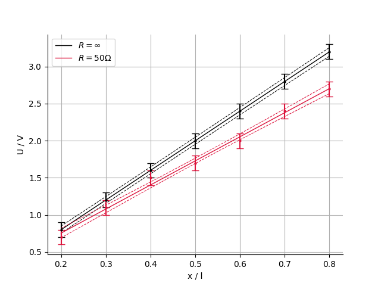

# Manual: Plotting a Fitted Function or Distribution

This document provides detailed instructions for plotting curve- and peak fits using the functionality provided by the fitting toolkit and matplotlibs pyplot.

## The Fit Object

The fitting toolkit provides a compact object that wraps all relevant information about a fit:
```py
fitting_toolkit.Fit(model, params: np.ndarray, cov: np.ndarray, axis: np.ndarray, upper: np.ndarray, lower: np.ndarray)
```

| Attribute | Description
|-----------|-------------
| model     | Reference to the fitted model function
| params    | Saves optimal parameters of fitted function
| cov       | Saves covariance matrix of fitted parameters
| axis      | x position where the confidence interval has been calculated.
| upper     | upper limit of confidence interval
| lower     | lower limit of confidence interval

The fit object is string convertible:
```py
>>> print(fit)
Fit(
    model = y(x, a, b)
    params = (0, 1)
    cov =
        [[1 0]
         [0 1]]
    axis = array()
    lower = array()
    upper = array()
)
```

To calculate the $\chi^2_\nu$-statistic for a given set of data points run:
```py
fit.reduced_chi_sqrd(x, y, dy)
```

## Displaying Fit via `plot_fit()`

<!--Note for maintainers: This section is covered in both the beginners manual and the tutorials !-->

`fitting_toolkit.plot_fit()` displays the fitted function generated by `fitting_toolkit.curve_fit()` via non linear regression. The following parameters are required:

| Parameters | | |
|----------|------------|-----------------|
| **Name** | **Type**   | **Description** |
| xdata    | np.ndarray | The x-values of the data points.
| ydata    | np.ndarray | The y-values of the data points.
| fit      | fitting_toolkit.Fit | Wrapper object containing model, fit results and confidence interval.

For customization the function also provides the keywords `markersize`, `capsize`, `fit_label`, and `confidence_label`

You may also pass keyword arguments to `matplotlib.pyplot.subplots()` via `**kwargs`. 
For comprehensive documentation please consult [`subplots()`](https://matplotlib.org/stable/api/_as_gen/matplotlib.pyplot.subplots.html), [`figure()`](https://matplotlib.org/stable/api/_as_gen/matplotlib.pyplot.figure.html#matplotlib.pyplot.figure) and [`add_plot()`](https://matplotlib.org/stable/api/_as_gen/matplotlib.figure.Figure.add_subplot.html#matplotlib.figure.Figure.add_subplot).
Please note that it's assumed that `subplots()` returns a figure object and a single axes object.

Common parameters include:
| Parameters | | |
|----------|------------|-----------------|
| **Name** | **Type**   | **Description** |
| figsize | (float, float) |     Width, height in inches.
| facecolor | color | The background color.
| layout | str | The layout mechanism for positioning of plot elements to avoid overlapping Axes decorations (labels, ticks, etc).
| aspect | str or float | {'auto', 'equal'} or float, aspect ratio of axes.
| alpha | float | Set the alpha value used for blending - not supported on all backends.


## Plotting Multiple Fits in the Same Graph

<!--Note for maintainers: This section is covered in both the beginners manual and the tutorials !-->

To add a new fit to an existing graph provide the `figure` and the `axes` object returned when calling the function for the first time.

```python
# fit two datasets to the same model separately
fit1 = curve_fit(f, x1, y1)
fit2 = curve_fit(f, x2, y2)

# display separately fitted models in the same graph
fig, ax = plot_fit(x1, y1, fit1)
fig, ax = plot_fit(x2, y2, fit2, fig = fig, ax = ax)
# fig and ax are returned; however, reassigning them is not required
```

In this example both datasets are fitted to the same model `f`, however this is an arbitrary choice.




It may be required to change the color of the fitted function for clarity, as can be seen in the example above.

```python
fig, ax = plot_fit(x, y, model, fit, fit_color = "crimson", fit_label="data label", confidence_label="label confidence interval")
```

You may set the color of the graph with the `fit_color` attribute. To label your data pass a `fit_label` and a `confidence_label` or pass `None`to remove them.

## Generate a Graphic with Multiple Plots 

## Using Custom Graphics

<!--Note for maintainers: This section is covered in both the technical documentation and the tutorials !-->

To generate your own plot you can use the returned values of `curve_fit`. Using a defined model `f(x, *params)`:

```python
fit = curve_fit(f, x, y)
#calculate standard deviations for possible later use
standard_deviations = np.sqrt(np.diagonal(fit.cov))

#extract interval from fit object
lower_conf = fit.lower
upper_conf = fit.upper
#get points at which confidence interval has been calculated
model_axis = fit.axis 

from matplotlib import pyplot as plt
#scatter data
plt.scatter(x, y)
# plots the fitted parameters
plt.plot(x, f(model_axis, *fit.params), color = "black")
#plots the confidence interval
plt.plot(model_axis, lower_conf, color = "red")
plt.plot(model_axis, upper_conf, color = "red")
#Display
plt.show()
```
