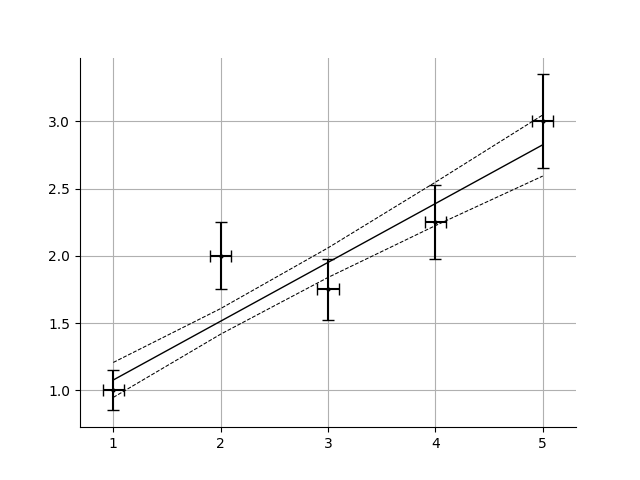
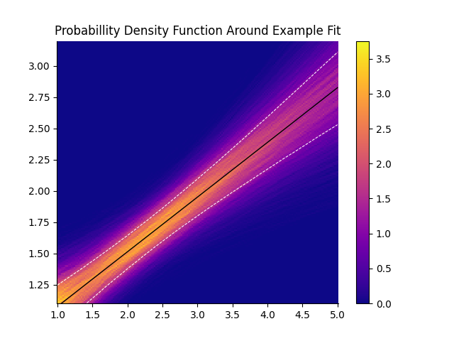
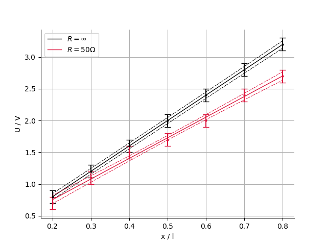

# Manual for the Fitting Toolkit

This toolkit provides all necessary functions for fitting and displaying data in a scatter plot with error bars, but we also maintain access to the basic functionalities.

These instructions provide a basic introduction on how to use the toolkit and later explains how to use its parts independently of each other.

## Getting Started

This section covers the use of the toolkit's functions as intended, which will cover most use cases.

To get started find the `fitting_toolkit.py` in the `src` folder and copy it into your project.
You can now import the relevant functions into your code:
```python
from fitting_toolkit import curve_fit, plot_fit 
import numpy as np
```
The `curve_fit` requires numpy-arrays. Therefore numpy has to be imported as well.

We can now start by simply defining our data.
```python
x = np.array((1, 2, 3, 4, 5))
y = np.array((1, 2, 1.75, 2.25, 3))
dy = 0.1*y+0.05
dx = 0.1
```
For a model we chose a simple linear model:
```python
def f(x, a, b):
    return a * x + b
```
We can now fit the model to the data:
```python
params, cov, lower_conf, upper_conf = curve_fit(f, x, y, yerror=dy)
```
This function returns 4 arrays. First the parameters of the model, the covariance matrix of those parameters and then the lower and upper limits of the confidence interval around the fit. Note that the confidence interval is absolute. To get the error in relation to the fitted function you would need to find the difference at each point.

The resulting fit can now be plotted. This toolkit provides a premade function to generate plots:
```python
from matplotlib import pyplot as plt
fig, ax = plot_fit(x, y, f, params, lower_conf, upper_conf, xerror=dx, yerror=dy)
plt.show()
```
Note that the fitted function is not automatically displayed. Instead the figure and axis objects are returned.



## Errors and Uncertainties

Understanding how the tools we use work with and calculate errors and uncertainties is a vital part of judging and quantifying the quality of our work. The toolkit's `curve_fit()` function uses scipy's `curve_fit()` function which handles the fitting process as well as the calculation of errors and correlation of the fitted parameters. You can reference the modules [documentation](https://docs.scipy.org/doc/scipy/reference/generated/scipy.optimize.curve_fit.html) for a detailed explanation.

### Covariance Matrix and Sigma

SciPy returns a [covariance matrix](https://en.wikipedia.org/wiki/Covariance) along with the optimal parameters of the fitted function. In [error propagation](https://en.wikipedia.org/wiki/Propagation_of_uncertainty) according to gauß we assume that the measured values are uncorrelated. In the real world this is usually not the case.

> Covariance in probability theory and statistics is a measure of the joint variability of two random variables.

The closer the absolute value of the covariance between two values is to the product of their standard deviations the more correlated they are. SciPy automatically finds a numerical approximation for the covariance between fit parameters. To extract the standard deviation of the fitted parameters take the root of the matrix diagonal.

```python
s1, s2, ..., sn = np.sqrt(np.diagonal(cov))
```

> Note that the relationship between cov and parameter error estimates is derived based on a linear approximation to the model function around the optimum. When this approximation becomes inaccurate, cov may not provide an accurate measure of uncertainty.

Further the documentation notes:

> How the sigma parameter affects the estimated covariance depends on `absolute_sigma` argument, as described above.

The `absolute_sigma` determines the interpretation of and effect the data errors have on the variance and covariance of the fitted parameters. By default the `absolute_sigma = False` which means that the errors are only used as weights, i.e., as hints how important a point should be in the least-squares computation. To compute the covariance matrix, `scipy.optimize.curve_fit` then estimates the actual error from the average deviation from the optimized curve. [(Read More Here)](https://wwwstaff.ari.uni-heidelberg.de/tsapras/pub/pycourse/15.html) When fitting data with absolute error bars as can be seen in the examples provided the `absolute_sigma` parameter should be set to `True` via the `**kwargs`.

```python
params, cov, lower_conf, upper_conf = curve_fit(model, x, y, yerror=dy, absolute_sigma = True)
```

Also note that only the y-error affects the uncertainty

### Calculation of the Confidence Interval

To estimate the confidence interval the fitted parameters are then resampled using their estimated means and covariance matrix. The number of resamples can be set via the `resamples = 5000` parameter.



For each point on the x-axis, the fitted function is calculated using all the resampled parameter sets. Then, the `numpy.percentile` function is used to estimate the upper and lower bounds of the confidence interval. By default, these bounds are set so that 1/6 of the resampled values are above the interval and 1/6 are below it. This means that 2/3 of the resampled values fall within the interval, which corresponds to a 1-sigma confidence level.

This method is often referred to as ["bootstrapping"](https://en.wikipedia.org/wiki/Bootstrapping_(statistics)) and presents a simple example of this method.

By default the confidence interval is estimated at each x-position of the data, however this may cause issues of resolution when data points are sparse or non-uniformly distributed along the x-axis, or it may be computationally expensive for large datasets. When a `confidence_resolution: int` parameter is set in `curve_fit`, that number of points is generated between the highest and lowest point on the x-axis and used as the x-axis instead.

```python
resampled_x_axis = np.linspace(min(xdata), max(xdata), confidence_resolution) 
```

Note that the `confidence_resolution` must be provided to both `curve_fit` and `plot_fit`  

### Specifying the Number of Standard Deviations

To specify the number of standard deviations to be calculated provide the `nsigma` parameter to either the `curve_fit()` function, or directly to `confidence_interval()`. By default one standard deviation is used. The upper and lower thresholds of the resulting gaussian curve are calculated by evaluating the gaussian integral between $\mu - n\cdot \sigma$ and $\mu + n\cdot \sigma$. By substituting
$$
    z = \frac{x - \mu} {\sigma}
$$
the probability to fall within an n- $\sigma$ interval can be calculated as

$$
    P(\mu - n\sigma < X < \mu + n\sigma) = \frac{1}{2}(\text{erf}(n/\sqrt{2}) - \text{erf}(-n/\sqrt{2})) := P_n
$$

The cutoff for the resampled points above the upper threshold ($u$) and the lower threshold ($l$) then is

$u_n = \frac{1}{2} + \frac{P_n}{2}$; $l_n = \frac{1}{2} - \frac{P_n}{2}$

Be aware, that
- For $n\gtrapprox 5.5$ the error function incorrectly evaluates to $\pm 1$. Larger standard deviations will all evaluate to the same distance from the fit.
- For large standard deviations ($\gtrapprox 3$) the approximation by resampling may require larger resampling sizes to be accurate.

## Using Plot-Fit

This section instructs on the basics of using the plot fit function.
For function documentation consult `./functions.md`.

### Plotting a Fitted Function

`fitting_toolkit.plot_fit()` displays the fitted function generated by `fitting_toolkit.curve_fit()`. The following parameters are required:

| Parameters | | |
|----------|------------|-----------------|
| **Name** | **Type**   | **Description** |
| xdata    | np.ndarray | The x-values of the data points.
| ydata    | np.ndarray | The y-values of the data points.
| model    | np.ndarray | The model function that takes `xdata` and model parameters as inputs.
| params   | np.ndarray | The parameters for the fitted model.
| lower    | np.ndarray | The lower bounds of the confidence intervals for the model predictions. 
| upper    | np.ndarray | The upper bounds of the confidence intervals for the model predictions.

If the upper and lower bounds were generated with a custom resolution, the same resolution must be provided in the `confidence_resolution` parameter.

For customization the function also provides the keywords `markersize`, `capsize`, `fit_label`, and `confidence_label`

You may also pass keyword arguments to `matplotlib.pyplot.subplots()` via `**kwargs`. 
For comprehensive documentation please consult [`subplots()`](https://matplotlib.org/stable/api/_as_gen/matplotlib.pyplot.subplots.html), [`figure()`](https://matplotlib.org/stable/api/_as_gen/matplotlib.pyplot.figure.html#matplotlib.pyplot.figure) and [`add_plot()`](https://matplotlib.org/stable/api/_as_gen/matplotlib.figure.Figure.add_subplot.html#matplotlib.figure.Figure.add_subplot).
Please note that it's assumed that `subplots()` returns a figure object and a single axes object.

Common parameters include:
| Parameters | | |
|----------|------------|-----------------|
| **Name** | **Type**   | **Description** |
| figsize | (float, float) |     Width, height in inches.
| facecolor | color | The background color.
| layout | str | The layout mechanism for positioning of plot elements to avoid overlapping Axes decorations (labels, ticks, etc).
| aspect | str or float | {'auto', 'equal'} or float, aspect ratio of axes.
| alpha | float | Set the alpha value used for blending - not supported on all backends.


### Plotting Multiple Fits In the Same Graph

To add a new fit to an existing graph provide the `figure` and the `axes` object returned when calling the function for the first time.

```python
# fit two datasets to the same model separately
params1, cov1, lower_conf1, upper_conf1 = curve_fit(f, x1, y1)
params2, cov2, lower_conf2, upper_conf2 = curve_fit(f, x2, y2)

# display separately fitted models in the same graph
fig, ax = plot_fit(x1, y1, f, params1, lower_conf1, upper_conf1)
fig, ax = plot_fit(x2, y2, f, params2, lower_conf2, upper_conf2, fig = fig, ax = ax)
# fig and ax are returned; however, reassigning them is not required
```

In this example both datasets are fitted to the same model `f`, however this is an arbitrary choice.




It may be required to change the color of the fitted function for clarity, as can be seen in the example above.

```python
fig, ax = plot_fit(x, y, model, params, lower, upper, fit_color = "crimson", fit_label="data label", confidence_label="label confidence interval")
```

You may set the color of the graph with the `fit_color` attribute. To label your data pass a `fit_label` and a `confidence_label` or pass `None`to remove them.