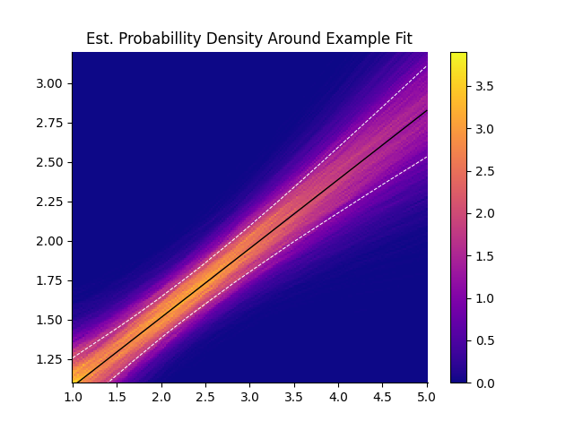

# Manual for the Fitting Toolkit

This toolkit provides all necessarry functions for fitting and displaying data in a scatter plot with errorbars, but we also maintain acess to the basic functionalities.

These instructions provide a basic introduction into the use of the toolkit and later explains how to use it's parts independently of each other.

## Getting Started

This section covers the use of the toolkit functionalities as intended, which will cover most use-cases.

To get started find the `fitting_toolkit.py` in the `src` folder and copy it into your project.
You can now import the relevant functions into your code:
```python
from fitting_toolkit import curve_fit, plot_fit 
import numpy as np
```
The `curve_fit` requires numpy-arrays. Therefore numpy has to be imported as well.

We can now start by simply defining our data.
```python
x = np.array((1, 2, 3, 4, 5))
y = np.array((1, 2, 1.75, 2.25, 3))
dy = 0.1*f+0.05
dx = 0.1
```
For a model we chose a simple linear model:
```python
def f(x, a, b):
    return a * x + b
```
We can now fit the model to the data:
```python
params, cov, lower_conf, upper_conf = curve_fit(f, x, y, yerror=dy)
```
This functions returns 4 arrays. First the parameters of the model, the covariance matrix of those parameters and then the lower and upper limits of the confidence interval around the fit. Note that the confidence interval is absolute. To get the error in relation to the fitted function you would need to find the difference at each point.

The resulting fit can now be plotted. This toolkit provides a premade function to generate plots:
```python
from matplotlib import pyplot as plt
fig, ax = plot_fit(x, y, f, params, lower_conf, upper_conf, xerror=dx, yerror=dy)
plt.show()
```
Note that the fitted function is not automatically displayed. Instead the figure and axis-objects are returned.


## Errors and Uncertainties

Understanding how the tools we use work with and calculate errors and uncertainties is a vital part of judging and quantifying the quality of our work. The toolkit-curve-fit uses scipy's `curve_fit()` function which handles the fitting process as well as the calculation of errors and correlation of the fitted parameters. You can reference the modules [documentation](https://docs.scipy.org/doc/scipy/reference/generated/scipy.optimize.curve_fit.html) for a detailed explanation.

### Covariance Matrix and Sigma

SciPy returns a [covariance matrix](https://en.wikipedia.org/wiki/Covariance) along with the optimal parameters of the fitted function. In [error propagation](https://en.wikipedia.org/wiki/Propagation_of_uncertainty) according to gauß we assume that the measured values are uncorrelated. In the real world this is usually not the case.

> Covariance in probability theory and statistics is a measure of the joint variability of two random variables.

The closer the absolute value of the covariance between two values is to the product of their standard deviations the more correlated they are. SciPy automatically finds a numerical approximation for the covariance between fit parameters.

> Note that the relationship between cov and parameter error estimates is derived based on a linear approximation to the model function around the optimum. When this approximation becomes inaccurate, cov may not provide an accurate measure of uncertainty.

Further the documentation notes:

> How the sigma parameter affects the estimated covariance depends on `absolute_sigma` argument, as described above.

The `absolute_sigma` determines the interpretation of and effect the data errors have on the variance and covariance of the fitted parameters. By default the `absolute_sigma = False` which means that the errors are only used as weights, i.e., as hints how important a point should be in the least-squares computation. To compute the covariance matrix, `scipy.optimize.curve_fit` then estimates the actual error from the average deviation from the optimized curve. [(Read More Here)](https://wwwstaff.ari.uni-heidelberg.de/tsapras/pub/pycourse/15.html) When fitting data with absolute errorbars as can be seen in the examples provided the `absolute_sigma` parameter should be set to `True` via the `**kwargs`.

```python
params, cov, lower_conf, upper_conf = curve_fit(model, x, y, yerror=dy, absolute_sigma = True)
```

Also note that only the y-error affects the uncertainty

### Calculation of the Confidence Interval

To estimate the confidence interval the fitted parameters are then resampled using their estimated means and covariance matrix. The number of resamples can be set via the `resamples = 5000` parameter.



For each point on the x-axis, the fitted function is calculated using all the resampled parameter sets. Then, the `numpy.percentile` function is used to estimate the upper and lower bounds of the confidence interval. By default, these bounds are set so that 1/6 of the resampled values are above the interval and 1/6 are below it. This means that 2/3 of the resampled values fall within the interval, which corresponds to a 1-sigma confidence level.

This method is often referred to as ["bootstrapping"](https://en.wikipedia.org/wiki/Bootstrapping_(statistics)) and presents a simple example of this method.

By default the confidence interval is estimated at each x-position of the data, however this may cause issues of resolution when datapoints are sparse or non-uniformly distributed along the x-axis, or it may be computanionally expensive for large datasets. When a `confidence_resolution: int` parameter is set in `curve_fit`, that number of points is generated between the highest and lowest point on the x-axis and used as the x-axis instead.

```python
resampled_x_axis = np.linspace(min(xdata), max(xdata), confidence_resolution) 
```

Note that the `confidence_resolution` must be provided to both `curve_fit` and `plot_fit`  